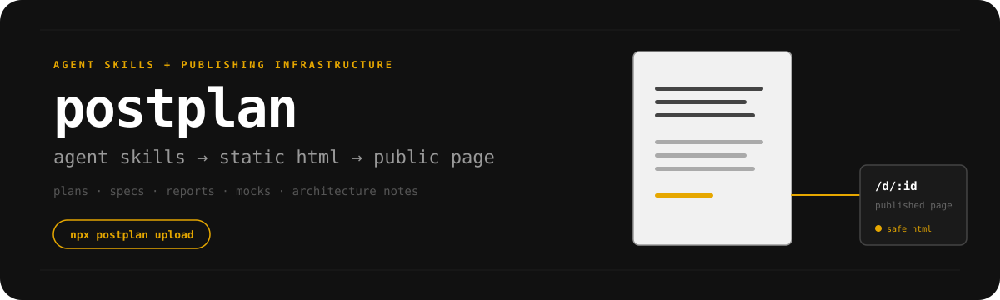

# postplan

[](https://workers.cloudflare.com)
[](https://developers.cloudflare.com/d1)
[](https://developers.cloudflare.com/r2/)
[](https://github.com/mcking-07/postplan/actions/workflows/ci.yml)
[](https://opensource.org/licenses/MIT)

infrastructure and agent skills for publishing static html plans, specs, reports, mocks, and architecture notes, compatible with the [postplan](https://www.npmjs.com/package/postplan) cli.



## overview

agents are good at producing structured work, but a markdown response is often a poor format for reviewing plans, specs, reports, mocks, and architecture notes.

static html gives those documents layout, diagrams, annotations, navigation, and visual structure. it creates a reviewable artifact that can be shared with teammates while pairing, discussing an implementation, or handing work off.

the agent creates the document. postplan provides the agent skill and cloudflare workers infrastructure for publishing, storing, versioning, and sharing finished artifacts through a public url.

## for agents

read the complete setup instructions in [`public/llms.txt`](./public/llms.txt).

### setup prompt

```text
read and follow the instructions at https://postplan.mcking.in/llms.txt and set up postplan on this machine.
```

the hosted instructions cover skill installation, document rules, uploads, draft urls, and api behavior.

### skill source

the published skill lives in [`public/skills/postplan/`](./public/skills/postplan/). it includes the main `SKILL.md` file and references for planning, reports, diagrams, and document style.

## for humans

### use the hosted service

1. open the [cli auth page](https://postplan.mcking.in/cli/auth)
2. generate an api key
3. configure the cli

```bash
npx postplan
postplan auth set <api-key> --api-url https://postplan.mcking.in
```

do not commit or share the api key.

### run the infrastructure locally

```bash
npm install
npm run db:migrate:local
npm run dev
```

the local worker runs at `http://localhost:9057`. copy `.dev.vars.example` to `.dev.vars` before using authenticated routes.

## deploy

```bash
npx wrangler login
npm run db:migrate:remote
npm run deploy
```

production bindings are defined in `wrangler.toml`. configure worker variables and secrets before deploying.

## contributing

contributions are welcome! please feel free to submit a pull request.

## license

[MIT](./LICENSE)
